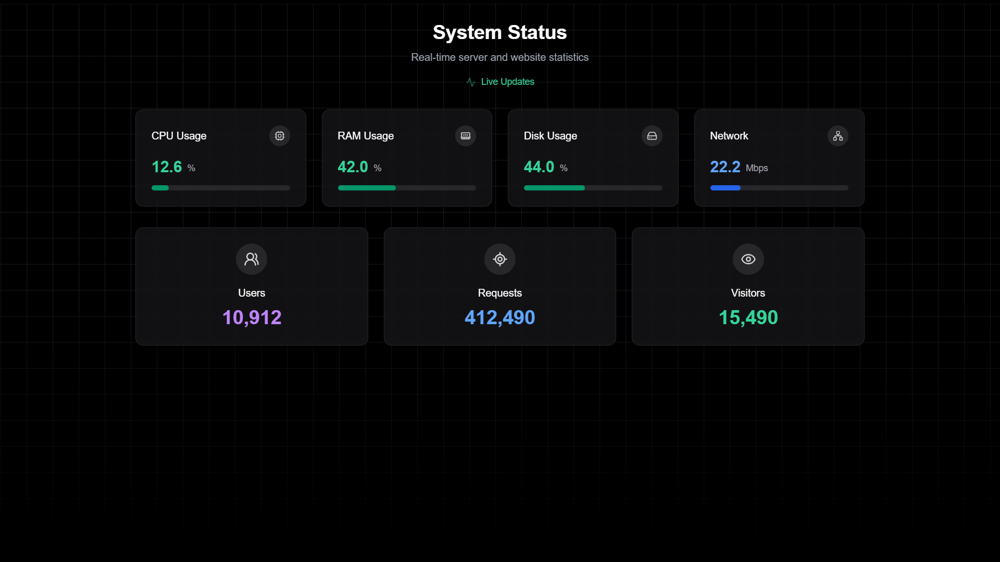
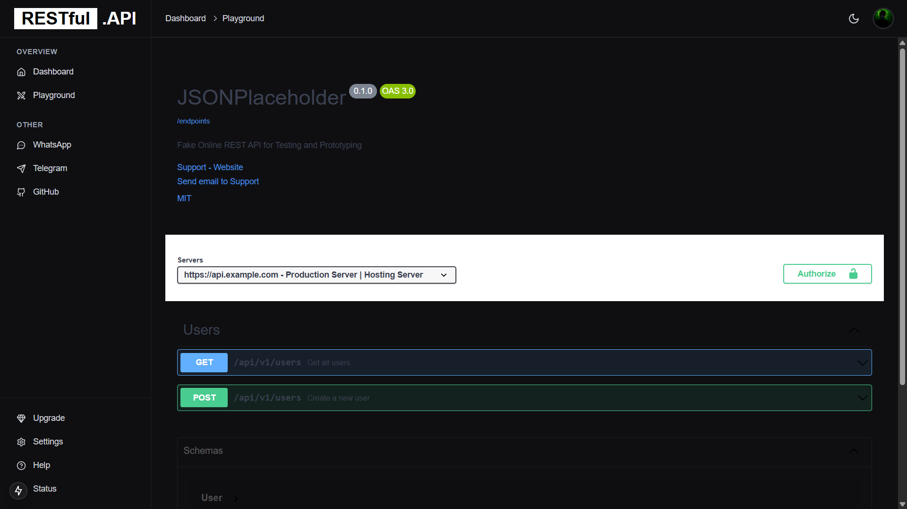

# 🚀 NEXTJS API Starter Kit

A powerful starter kit built with **Next.js**, **Tailwind CSS**, and **Swagger UI** — perfect for building modern REST API platforms with user authentication, dashboards, freemium upgrade pages, and built-in API documentation playground.

<div align="center" style"border-radius:15px">
    <a href="https://demo.domain.com/nextjs-api-starter-kit">
        
    </a>
    <a href="https://sociabuzz.com/galaxd/p/nextjs-api-starter-kit">
        
    </a>
</div>

---
## 📚Table of Contents
- [Screenshot](#️-preview-screenshots)
- [Features](#-features)
- [Tech Stack](#-tech-stack)
- [Quick start](#-quick-start)
- [File Structure](#-quick-start)

---

## 🖼️ Preview Screenshots

| Landing Page | Dashboard |
|--------------|-----------|
|  |  |

| Status | Swagger Playground |
|------------|--------------------|
|  |  |

---

## ✨ Features

- 🌐 Beautiful landing page (Tailwind CSS)
- 🔐 Login & registration system
- 📊 User dashboard with access control
- 💎 Upgrade page for free/premium plans
- 🧪 API Playground using Swagger UI inside the dashboard
- ⚙️ RESTful API routes with OpenAPI documentation
- 🔑 API Key system with rate limiting
- 📁 Clean and modular project structure

### 🆚 Free vs Premium Comparison

| FEATURES                      |   FREE   | PREMIUM |
|----------------------------   |:--------:|:-------:|
| Swagger UI                    |   ✅     |   ✅    |
| Landing Page                  |   ✅     |   ✅    |
| Dashboard Page                |   ✅     |   ✅    |
| Upgrade Plan Page             |   ✅     |   ✅    |
| Login & Register Page         |   ❌     |   ✅    |
| Rate Limit                    |   ❌     |   ✅    |
| ApiKey Access                 |   ❌     |   ✅    |
| Account Management            |   ❌     |   ✅    |
| Priority Support              |   ❌     |   ✅    |
| Access to Exclusive Features  |   ❌     |   ✅    |
| Get the Latest Updates        |   ❌     |   ✅    |

---

## 🔑 API Key System

This project includes a built-in API key system for managing access to protected endpoints.

### How it works:

- Every registered user is assigned a unique API key.
- API keys must be passed in the `x-api-key` header.
- Different rate limits can be set for free vs. premium users.
- Invalid or missing API keys will result in a `401 Unauthorized` error.

---

## 🧱 Tech Stack

- **Next.js**
- **Tailwind CSS**
- **Swagger UI (OpenAPI 3.x)**
- **TypeScript / JavaScript**
- **Axios / Fetch**
- **MongoDB, JWT, NextAuth**

---

## 🛠 Quick start
1. Clone this repository or download from [MGalaCyber](https://github.com/MGalaCyber/nextjs-api-starter-kit)
2. Make sure you have **Node.js** installed on your machine.
3. Install the dependencies using your preferred package manager:
```bash
npm install
# or
yarn install
# or
pnpm install
# or
bun install
```
4. Start the development server:
```bash
npm run dev
# or
yarn dev
# or
pnpm dev
# or
bun dev
```
5. Open http://localhost:3000 in your browser to view the app.


### Example request with API key:

```http
GET /api/v1/endpoint
Host: yourdomain.com
X-Api-Key: your-api-key-goes-here
```

---

## File Structure
```
.
├── public
│   ├── preview
│   │   ├── dashboard.png
│   │   ├── landing.png
│   │   ├── playground.png
│   │   └── status.png
│   ├── file.svg
│   ├── globe.svg
│   ├── next.svg
│   ├── vercel.svg
│   └── window.svg
├── src
│   ├── actions
│   │   └── auth.ts
│   ├── app
│   │   ├── actions
│   │   │   └── github.ts
│   │   ├── api
│   │   │   ├── data
│   │   │   │   ├── stats
│   │   │   │   │   └── route.ts
│   │   │   │   └── user
│   │   │   │       └── route.ts
│   │   │   ├── test
│   │   │   │   └── route.ts
│   │   │   └── v1
│   │   │       └── users
│   │   │           └── route.ts
│   │   ├── dashboard
│   │   │   ├── playground
│   │   │   │   └── page.tsx
│   │   │   ├── pricing
│   │   │   │   └── page.tsx
│   │   │   └── page.tsx
│   │   ├── endpoints
│   │   │   └── route.ts
│   │   ├── login
│   │   │   └── page.tsx
│   │   ├── status
│   │   │   └── page.tsx
│   │   ├── favicon.ico
│   │   ├── globals.css
│   │   ├── layout.tsx
│   │   └── page.tsx
│   ├── assets
│   ├── components
│   │   ├── kokonutui
│   │   │   ├── stats
│   │   │   │   ├── account.tsx
│   │   │   │   └── global.tsx
│   │   │   ├── content.tsx
│   │   │   ├── dashboard.tsx
│   │   │   ├── layout.tsx
│   │   │   ├── profile.tsx
│   │   │   ├── project-list.tsx
│   │   │   ├── settings.tsx
│   │   │   ├── sidebar.tsx
│   │   │   └── top-nav.tsx
│   │   ├── ui
│   │   │   ├── alert-dialog.tsx
│   │   │   ├── button.tsx
│   │   │   ├── card.tsx
│   │   │   ├── dialog.tsx
│   │   │   ├── dropdown-menu.tsx
│   │   │   ├── input.tsx
│   │   │   ├── label.tsx
│   │   │   ├── progress.tsx
│   │   │   └── tabs.tsx
│   │   ├── background.tsx
│   │   ├── footer.tsx
│   │   ├── login-content.tsx
│   │   ├── login-form.tsx
│   │   ├── preloader.tsx
│   │   ├── theme-provider.tsx
│   │   ├── theme-toggle.tsx
│   │   └── type-writer.tsx
│   ├── config
│   │   ├── site.ts
│   │   ├── swagger.ts
│   │   └── swaggerCompiler.ts
│   ├── hooks
│   │   ├── useCountUp.ts
│   │   └── useTextScramble.ts
│   ├── lib
│   │   ├── responseHandlers.ts
│   │   └── utils.ts
│   ├── sections
│   ├── types
│   │   ├── auth.ts
│   │   └── swagger.ts
│   └── middleware.ts
├── .env
├── .gitignore
├── components.json
├── eslint.config.mjs
├── LICENSE
├── next-env.d.ts
├── next.config.ts
├── package.json
├── pnpm-lock.yaml
├── postcss.config.mjs
├── README.md
├── tailwind.config.ts
└── tsconfig.json
```